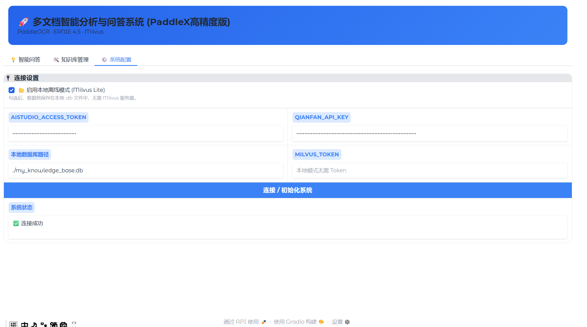
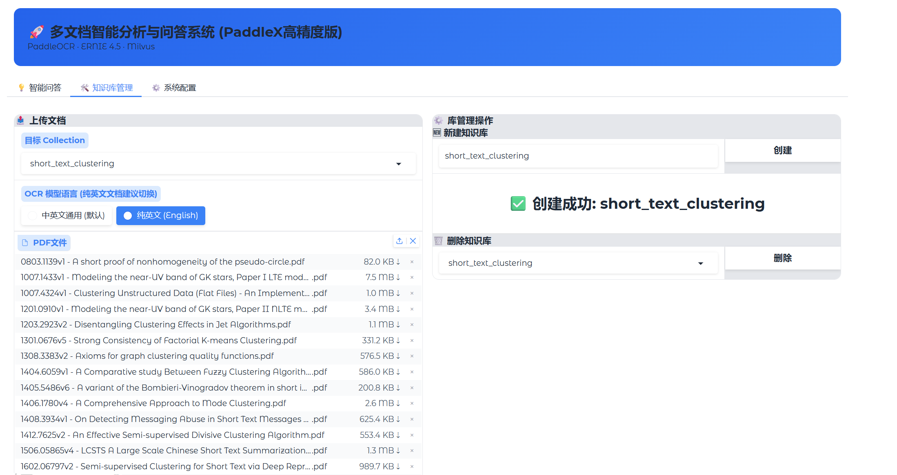
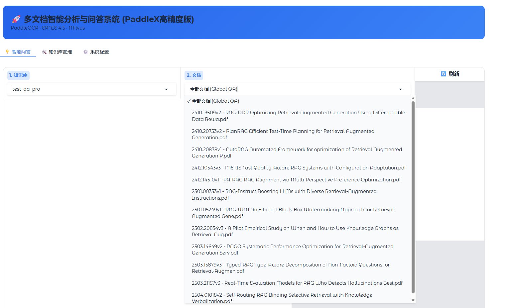
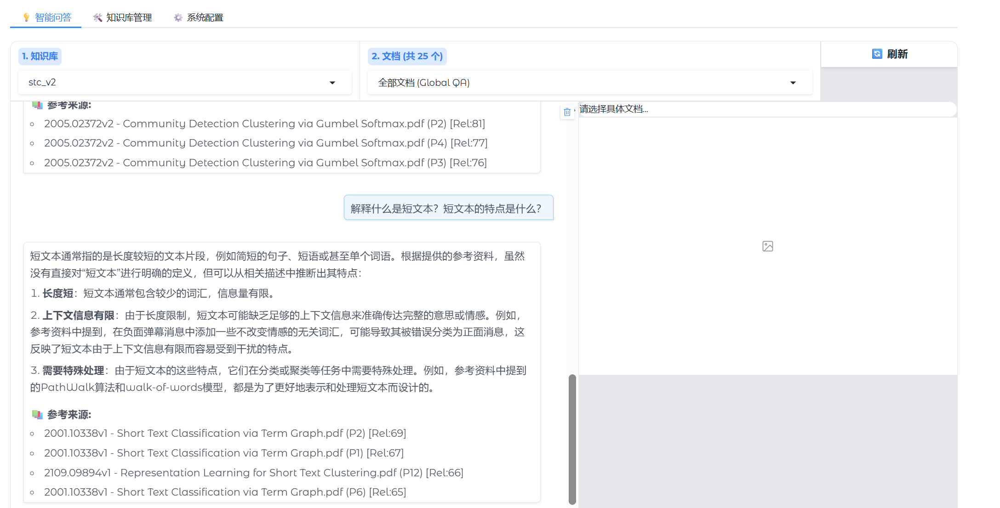
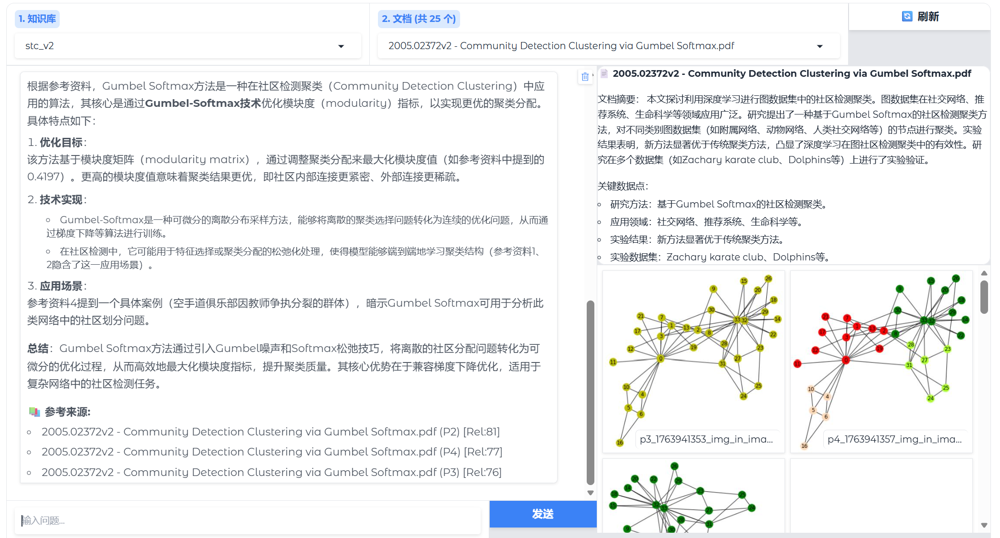

# 🚀 Paddle-RAG: 基于 ERNIE 4.5 与 PaddleX 的多文档智能分析系统

<center>
一个集成了百度文心一言 (ERNIE 4.5) 大模型与 PaddleX 高精度文档解析技术的本地化 RAG 知识库系统。
</center>

[English Version](README_EN.md)


## 📖 项目简介
本项目是一个高性能的文档问答系统（RAG），专为处理复杂的学术论文和技术文档设计。不同于传统的基于 LangChain 的简单文本切分，本项目深度集成了 PaddleX (PP-StructureV3) 智能文档解析引擎，能够精准识别 PDF 中的版面布局、表格、公式和图片。

结合 百度 ERNIE 4.5 的强大语义理解能力和 Milvus 向量数据库，实现了“所问即所得”的精准溯源问答。支持本地离线模式 (Milvus Lite)，无需复杂服务器即可部署。

## ✨ 核心特性
- 🧠 百度双引擎驱动：
  - LLM: 接入 ERNIE-4.5-Turbo (通过 AIStudio API)，具备顶尖的中文理解与生成能力。
  - OCR: 集成 PaddleX PP-StructureV3，支持复杂版面还原，自动提取图表。
- 📂 智能文档处理：
  - 自动去重：上传时自动检测库中是否已存在同名文件，避免重复计算。
  - 精准页码索引：基于页面的动态切分策略，回答中包含确切的页码引用（如 P1, P2），拒绝幻觉。
- ⚡ 混合检索 (Hybrid Search)：融合 Dense Vector (语义向量) 与 Keyword (关键词) 检索，并使用 RRF 算法优化排序，大幅提升召回率。
- 🖼️ 多模态上下文：不仅能回答文字，还能提取并展示文档中的关键图表、插图作为回答的上下文补充。
## 📸 功能演示

### 1. 系统配置与本地模式
支持一键切换 **云端 Milvus** 或 **本地离线模式 (Milvus Lite)**。只需配置百度 AIStudio 和千帆 API Key 即可启动，数据完全掌握在自己手中。


### 2. 知识库构建与智能解析
基于 PaddleX V3 的智能解析引擎，支持中/英文模型切换。系统配备实时进度条，解析过程透明化。


### 3. 全局文档管理
支持多知识库 (Collection) 管理，可查看库中所有文档列表。支持针对“全部文档”进行宏观问答，或锁定“单一文档”进行深度阅读。


### 4. 精准问答与溯源
提问后，系统会展示检索到的参考片段，并标注**精准的页码**和**相关性得分**。


### 5. 图表与知识融合
系统会自动提取 PDF 中的图片和图表（如知识图谱结构图、数据统计图）。在回答问题时，相关联的图片会自动展示在右侧，辅助理解。

## 📥 快速体验 (下载即用)

如果您不想手动上传和解析文档，可以直接下载我制作好的**演示数据库**，解压后即可直接提问。
该数据库包含了多篇关于 RAG 和短文本聚类的学术论文，及其提取的图表数据。

1.  **下载数据包**：[点击这里下载 (Google Drive)]([https://drive.google.com/drive/folders/1avg_m1YKMJPYz5OS9ScA_rXydJBZ7fse?usp=drive_link])
2.  **解压文件**：将压缩包解压，您会得到一个 `my_knowledge_base.db` 文件和一个 `assets` 文件夹。
3.  **覆盖安装**：将上述文件和文件夹直接复制到本项目的**根目录**下（覆盖同名文件）。
4.  **运行程序**：执行 `python main.py`，系统将自动加载演示数据，您可以直接开始提问！

## 📦 安装与使用
### 前置要求
- Python 3.10
- 百度 AIStudio 访问令牌 (Access Token)
- 百度千帆 API Key

### 1. 克隆仓库
```bash
git clone git@github.com:LiaoYFBH/Paddle-ERNIE-RAG.git
cd Paddle-ERNIE-RAG
```

### 2. 安装依赖
```bash
# 基础依赖
pip install -r requirements.txt

# 安装 PaddlePaddle (CPU版示例，GPU版请参考官网)
python -m pip install paddlepaddle -i https://mirror.baidu.com/pypi/simple


# 安装 PaddleX
pip install paddlex
```

### 3. 启动系统
```bash
python main.py
```
启动后，终端会显示本地访问地址（通常为 http://127.0.0.1:7860）。

## ⚙️ 环境变量配置
您可以在启动 UI 后在“系统配置”面板填写，也可以在项目根目录创建 `.env` 文件预设：
```env
AISTUDIO_ACCESS_TOKEN=your_aistudio_token
QIANFAN_API_KEY=your_qianfan_key
# 可选：如果使用云端 Milvus
MILVUS_URI=https://...
MILVUS_TOKEN=...
```

## 📄 许可证
MIT License